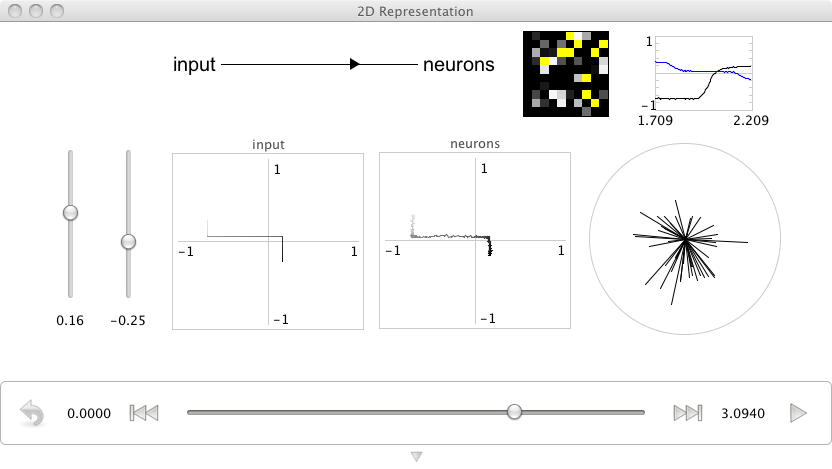

2D representation
=================

**Purpose**:
This demo shows how to construct and manipulate
a population of 2D neurons.

**Comments**:
These are 100 leaky integrate-and-fire (LIF) neurons.
The neuron tuning properties have been randomly selected
to encode a 2D space
(i.e. each neuron has an encoder randomly selected from the unit circle).

**Usage**:
Grab the slider controls and move then up and down
to see the effects of shifting the input throughout the 2D space.
As a population, these neurons do a good job
of representing a 2D vector value.
This can be seen by the fact that
the input graph and neurons graphs match well.

The "circle" plot is showing
the preferred direction vector
of each neuron multplied by its firing rate.
This kind of plot was made famous by Georgoupolos et al.

.. literalinclude:: ../../simulator-ui/dist-files/demo/2drepresentation.py
