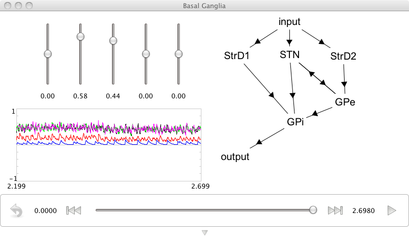

Basal Ganglia
=============

**Purpose**:
This demo introduces the basal ganglia model
that the SPA exploits to do action selection.

**Comments**:
This is the basal ganglia in isolation, not hooked up to anything.
It demonstrates that this model operates as expected;
i.e., it supresses the output corresponding
to the input with the highest input value.

This is an extension to a spiking, dynamic model
of the Redgrave et al. work.
It is more fully described in several CNRG lab publications.
It exploits the "nps" class from Nengo.

**Usage**:
After running the demo, play with the 5 input sliders.
The highest slider should always be selected in the output.
When they are close, interesting things happen.
You may even be able to tell that things
are selected more quickly for larger differences in input values.

.. literalinclude:: ../../simulator-ui/dist-files/demo/basalganglia.py
