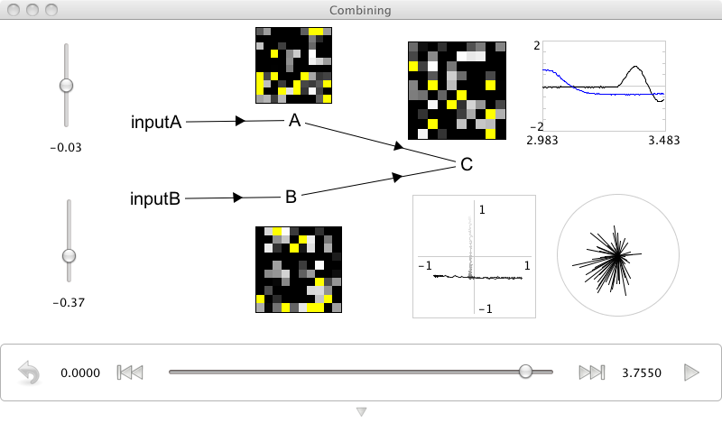

Combining 1D representations into a 2D representation
=====================================================

**Purpose**:
This demo shows how to construct a network
that combines two 1D inputs into a 2D representation.

**Comments**:
This can be thought of as two communication channels
projecting to a third population,
but instead of combining the input (as in addition),
the receiving population represents them as being independent.

**Usage**:
Grab the slider controls and move them up and down
to see the effects of increasing or decreasing input.
Notice that the output population
represents both dimensions of the input independently,
as can be seen by the fact
that each input slider only changes
one dimension in the output.

.. literalinclude:: ../../simulator-ui/dist-files/demo/combining.py

.. topic:: Video:

   .. raw:: html

      <iframe width="100%" height="400" src="https://www.youtube.com/embed/P8zHjvYK_Uo" frameborder="0" allowfullscreen></iframe>
