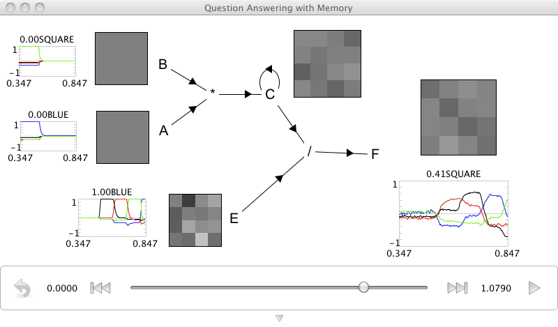

A question answering network with memory
========================================

**Purpose**:
This demo performs question answering
based on storing items in a working memory.

**Comments**:
This demo is very much like the question answering demo
(it would be good to read that first).
However, it answers questions based on past input,
not the immediate input.

**Usage**:
When you run the network,
it will start by binding "RED" and "CIRCLE"
and then binding "BLUE" and "SQUARE"
so the memory essentially has "RED*CIRCLE + BLUE*SQUARE".
The input from A and B is turned off,
and E is then run through the vocabulary.
The appropriately unbound element for each vocabulary word
shows up in F as appropriate.

.. literalinclude:: ../../simulator-ui/dist-files/demo/question_memory.py
