Linear Transformations
=======================

Creating Terminations
----------------------

* Connections between ensembles are built using Origins and Terminations.  The Origin from one ensemble can be connected to the Termination on the next ensemble
* Create two ensembles.  They can have different neural properties and different numbers of neurons, but for now make sure they are both one-dimensional.
* Drag the Termination icon from the sidebar onto the second ensemble

   * Provide a name (for example, ``input``)
   * Set the input dimension to 1 and use Set Weights to set the connection weight to 1
   * Set tauPSC to 0.01 (this synaptic time constant differs according to which neurotransmitter is involved.  10ms is the time constant for AMPA (5-10ms).

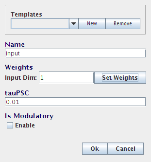

.. image:: images/p2-2.png

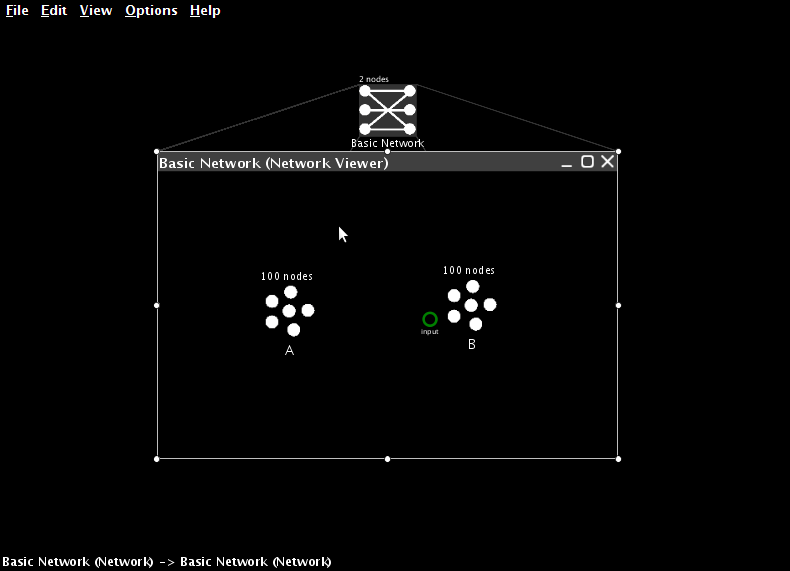

Creating Projections
----------------------

* We can now connect the two neural ensembles.
* Every ensemble automatically has an origin called X.  This is an origin suitable for building any linear transformation.  In Part Three we will show how to create origins for non-linear transformations.

.. image:: images/p2-4.png

* Click and drag from the origin to the termination.  This will create the desired projection.

.. image:: images/p2-5.png

Adding Inputs
----------------

* In order to test that this projection works, we need to set the value encoded by the first neural ensemble.  We do this by creating an input
  to the system.  This is how all external inputs to Nengo models are specified.
* Drag a Function Input icon from the sidebar into the network.
* Give it a name (for example, ``external input``)
* Set its output dimensions to 1

.. image:: images/p2-6.png

* Press Set Function to define the behaviour of this input
* Select Constant Function from the drop-down list and then press Set to define the value itself. For this model, set it to 0.5.

.. image:: images/p2-7.png

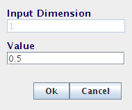

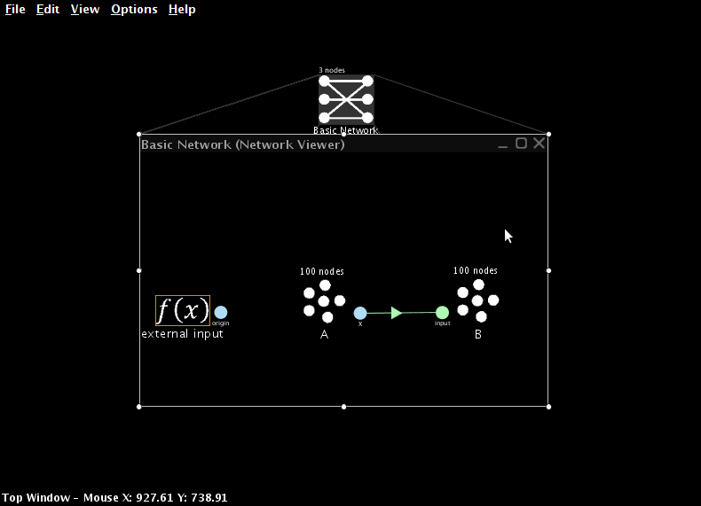

* Add a termination on the first neural ensemble (as before) and create a projection (as before) from the new input to that ensemble.

.. image:: images/p2-10.png

Interactive Plots
------------------

* To observe the performance of this model, we now switch over to Interactive Plots.  This allows us to both graph the performance of the
  model and adjust its inputs on-the-fly to see how this affects behaviour.
* Start Interactive Plots by right-clicking inside the Network and selecting Interactive Plots or clicking the 'double sine' icon at the top right.

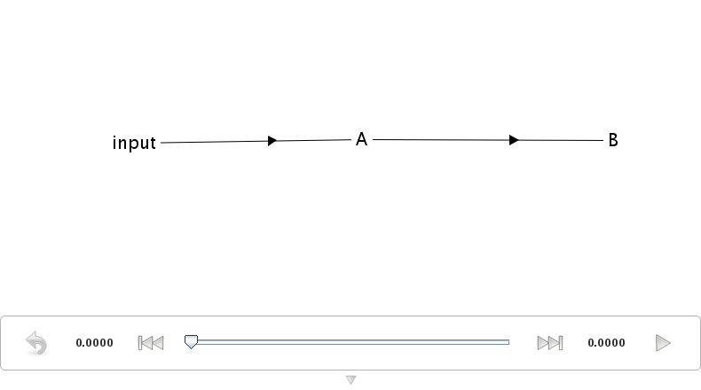

* The text shows the various components of your model, and the arrows indicate the synaptic connections between them.

   * You can move the components by left-click dragging them, and you can move all the components by dragging the background.
   * You can hide a component by right-clicking on it and selecting "hide"
   * To show a hidden component, right click on the background and select the component by name

* The bottom of the window shows the controls for running the simulation.

   * The simulation can be started and stopped by pressing the Play or Pause button at the bottom right.  Doing this right now will run the simulation, but no data will be displayed since we don't have any graphs open yet!
   * The reset button on the far left clears all the data from the simulation and puts it back to the beginning.
   * In the middle is a slider that shows the current time in the simulation.  Once a simulation has been run, we can slide this back and forth to observe data from different times in the simulation.

* Right-clicking on a component also allows us to select a type of data to show about that component.

   * Right-click on A and select "value".  This creates a graph that shows the value being represented by the neuron in ensemble A.  You can move the graph by left-click dragging it, and you can resize it by dragging near the corners or using a mouse scroll wheel.
   * Press the Play button at the bottom-right or the window and confirm that this group of neurons successfully represents its input value, which we previously set to be 0.5.

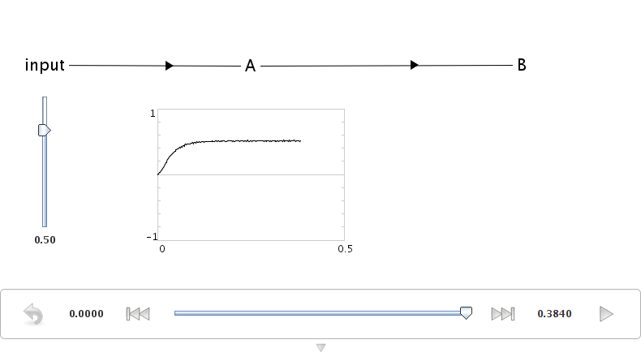

* Now let us see what happens if we change the input.  Right-click on the input and select "control".  This lets us vary the input while the simulation is running.
* Drag the slider up and down while the simulation is running (press Play again if it is paused).  The neurons in ensemble A should be able to successfully represent the changing values.

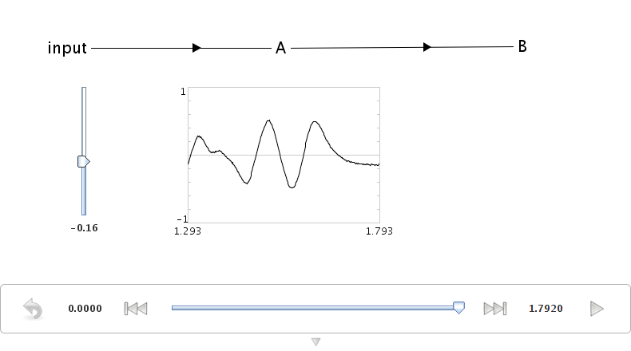

* We can also view what the individual neurons are doing during the simulation.  Right-click on A and choose "spike raster".  This shows the
  individual spikes coming from the neurons.  Since there are 100 neurons in ensemble A, the spikes from only a sub-set of these are shown.
  You can right-click on the spike raster graph and adjust the proportion of spikes shown.  Change it to 50%.
* Run the simulation and change the input.  This will affect the neuron firing patterns.

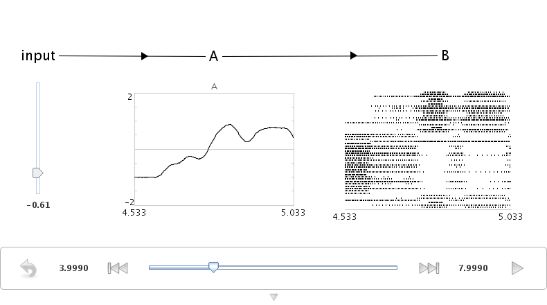

* We can also see the voltage levels of all the individual neurons.  Right-click on A and choose "voltage grid".  Each neuron is shown as a square and the shading of that square indicates the voltage of that neuron's cell membrane, from black (resting potential) to white (firing threshold).  Yellow indicates a spike.
* The neurons are initially randomly ordered.  You can change this by right-clicking on the voltage grid and selecting "improve layout".  This will attempt to re-order the neurons so that neurons with similar firing patterns are near each other, as they are in the brain.  This does not otherwise affect the simulation in any way.
* Run the simulation and change the input.  This will affect the neuron voltage.

.. image:: images/p2-105.png

* So far, we have just been graphing information about neural ensemble A.  We have shown that these 100 neurons can accurately represent a value that is directly input to them.
* For this to be useful for constructing cognitive models, we need to also show that the spiking output from this group of neurons can be used to transfer this information from one neural group to another.

   * In other words, we want to show that B can represent the same thing as A, where B's only input is the neural firing from group A.  For this to happen, the correct synaptic connection weights between A and B (as per the Neural Engineering Framework) must be calculated.
   * Nengo automatically calculates these weights whenever an origin is created.

* We can see that this communication is successful by creating graphs for ensemble B.

   * Do this by right-clicking on B and selecting "value", and then right-clicking on B again and selecting "voltage grid".
   * To aid in identifying which graph goes with which ensemble, right click on a graph and select "label".
   * Graphs can be moved (by dragging) and resized (by dragging near the edges and corners or by the mouse scroll wheel) as desired.

.. image:: images/p2-106.png

* Notice that the neural ensembles can be representing the same value, but have a different firing pattern.
* Close the Interactive Plots when you are finished.

Adding Scalars
-----------------

* If we want to add two values, we can simply add another termination to the final ensemble and project to it as well.
* Create a termination on the second ensemble called ``input 2``
* Create a new ensemble
* Create a projection from the X origin to input 2

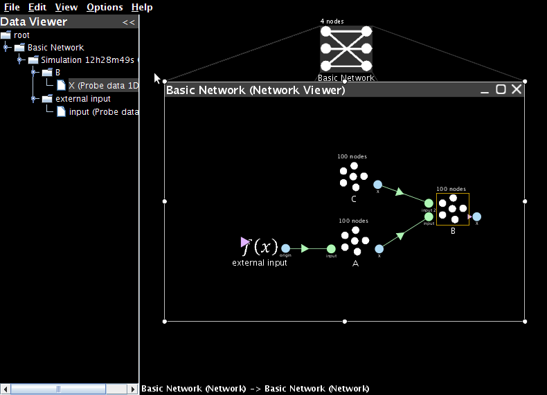

* Create a new Function Input and set its constant value to -0.7
* Add the required termination and projection to connect it to the new ensemble

.. image:: images/p2-20.png

* Open Interactive Plots
* Show the controls for the two inputs
* Create value graphs for the three neural ensembles
* Press Play to start the simulation.  The value for the final ensemble should be 0.5-0.7=-0.2
* Use the control sliders to adjust the input.  The output should still be the sum of the inputs.

.. image:: images/p2-107.png

* This will be true for most values.  However, if the sum is outside of the radius that was set when the neural group was formed (in this case, from -1 to 1), then the neurons may not be able to fire fast enough to represent that value (i.e., they will saturate).  Try this by computing 1+1.  The result will only be around 1.3.
* To accurately represent values outside of the range -1 to 1, we need to change the radius of the output ensemble.  Return to the Nengo Workspace and configure ensemble B.  Change its 'radii' to 2.  Now return to the Interactive Plots.  The network should now accurately compute that 1+1=2.

Adjusting Transformations
--------------------------

* So far, we have only considered projections that do not adjust the values being represented in any way.  However, due to the NEF derivation of the synaptic weights between neurons, we can adjust these to create arbitrary linear transformations (i.e. we can multiply any represented value by a matrix).
* Each termination in Nengo has an associated transformation matrix.  This can be adjusted as desired.  In this case, we will double the weight of the original value, so instead of computing x+y, the network will compute 2x+y.
* Right-click on the first termination in the ensemble that has two projections coming into it. Select Inspector.  Double-click on transform.
* Double-click on the 1.0 and change it to 2.0.

.. image:: images/p2-22.png

* Click 'Save Changes'.
* Now run the simulation.  The final result should be 2(0.5)-0.7=0.3

Multiple Dimensions
----------------------

* Everything discussed above also applies to ensembles that represent more than one dimension.
* To create these, set the number of dimensions to 2 when creating the ensemble

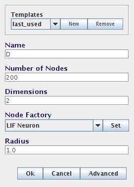

* When adding a termination, the input dimension can be adjusted.  This defines the shape of the transformation matrix for the termination, allowing for projections that change the dimension of the data

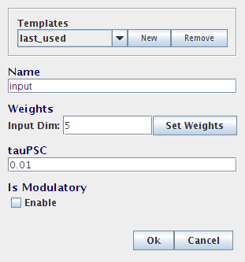

* For example, two 1-dimensional values can be combined into a single two-dimensional ensemble.  This would be done with two terminations: one with a transformation (or coupling) matrix of [1 0] and the other with [0 1].  If the two inputs are called a and b, this will result in the following calculation:

   * ``a*[1 0] + b*[0 1] = [a 0] + [0 b] = [a b]``
   * This will be useful for creating non-linear transformations, as discussed further in the next section.

* There are additional ways to view 2D representations in the interactive plots, including:

    * Plotting the activity of the neurons along their preferred direction vectors
    * Plotting the 2D decoded value of the representation

.. image:: images/p2-108.png

Scripting
------------

* Along with the ability to construct models using this point-and-click interface, Nengo also provides a Python scripting language interface for model creation.  These examples can be seen in the "demo" directory.
* To create the communication channel through the scripting interface, click on the Folder icon (top left), navigate to the /demo directory (inside the Nengo home folder) and open "communication.py"

* The actual code for this can be seen by opening the communication.py file in a text editor::

    import nef

    net=nef.Network('Communications Channel')
    input=net.make_input('input',[0.5])
    A=net.make('A',100,1)
    B=net.make('B',100,1)
    net.connect(input,A)
    net.connect(A,B)
    net.add_to(world)

* The following demo scripts create models similar to those seen in this part of the tutorial:

   - ``demo/singleneuron.py`` shows what happens with an ensemble with only a single neuron on it (poor representation)
   - ``demo/twoneurons.py`` shows two neurons working together to represent
   - ``demo/manyneurons.py`` shows a standard ensemble of 100 neurons representing a value
   - ``demo/communication.py`` shows a communication channel
   - ``demo/addition.py`` shows adding two numbers
   - ``demo/2drepresentation.py`` shows 100 neurons representing a 2-D vector
   - ``demo/combining.py`` shows two separate values being combined into a 2-D vector
