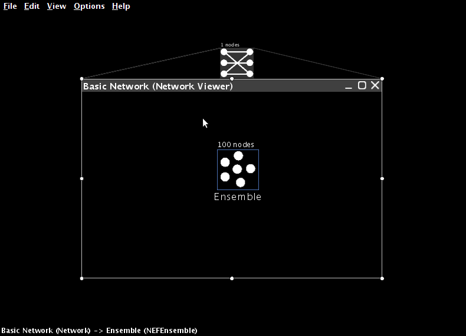

1. One-dimensional representation
=================================

Open Nengo, as described in :doc:`../getting_started`.

Creating networks
-----------------

When creating an NEF model, the first step is to create a Network.
This will contain all of the neural ensembles
and any needed inputs to the system.

* Click on File -> New Network (or drag a network from the sidebar).

* Give the network a name.

  .. image:: ../images/p1-2.png

You can create networks inside of other networks.
This can be useful for hierarchical organization of models.

Creating an ensemble
--------------------

Ensembles must be placed inside networks in order to be used.

* Drag an ensemble from the sidebar and drop it in the network.

  .. image:: ../images/p1-3.png

Here are the basic features of the ensemble that can be configured:

* Name

* Number of nodes (i.e. neurons)

* Dimensions
  (the number of values in the vector encoded by these neurons;
  leave at 1 for now)

* Radius
  (the range of values that can be encoded;
  for example, a value of 100 means the ensemble
  can encode numbers between -100 and 100)

* Node Factory (the type of neuron to use)

  .. image:: ../images/p1-4.png

For this tutorial (and for the majority of our research),
we use "LIF Neuron", the standard leaky integrate-and-fire neuron.

* Clicking on Set allows for the neuron parameters to be configured:

  * tauRC (RC time constant for the neuron membrane; usually 0.02)

  * tauRef (absolute refractory period for the neuron; usually 0.002)

  * Max rate
    (the maximum firing rate for the neurons;
    each neuron will have a maximum firing rate chosen
    from a uniform distribution between low and high)

  * Intercept
    (the range of possible x-intercepts on the tuning curve graph;
    normally set to -1 and 1)

Because there are many parameters to set
and we often choose similar values,
Nengo will remember your previous settings.

.. deprecated:: 1.4
   Also, you can save templates by setting up the parameters
   as you like them and clicking on New in the Templates box.
   You will then be able to go back to these settings
   by choosing the template from the drop-down box.

* You can double-click on an ensemble
  to view the individual neurons within it.

  .. image:: ../images/p1-5b.png

Plotting tuning curves
----------------------

The tuning curve plot shows the behaviour of each neuron
when it is representing different values
(i.e. the tuning curves for the neurons).

* Right-click on the ensemble and select Plot -> Constant Rate Responses.

  .. image:: ../images/p1-6.png

The following parameters have a large effect on the tuning curves.

* tauRC affects the linearity of the neurons (smaller values are more linear).

* Max rate affects the height of the curves at the left and right sides.

* Intercept affects where the curves hit the x-axis
  (i.e. the value where the neuron starts firing).

Plotting representation error
-----------------------------

We often want to determine the accuracy of a neural ensemble.

* Right-click on the ensemble, select Plot -> Plot Distortion:X.

  .. image:: ../images/p1-7.png

Mean Squared Error (MSE) is also shown (at the top).
MSE decreases as the square of the number of neurons
(so RMSE is proportional to :math:`1 \over N`).

We can also affect representation accuracy
by adjusting the range of intercepts.
This will cause the system to be more accurate
in the middle of the range and less accurate at the edges.

Adjusting an ensemble
---------------------

After an ensemble is created,
we can inspect and modify many of its parameters.

* Right-click on an ensemble and select Inspector
  (or select the ensemble and
  click the magnifying glass in the top right)

  .. image:: ../images/p1-8.png

The following properties can be inspected and modified:

* neurons (number of neurons; this will rebuild the whole ensemble)

* radii (the range of values that can be encoded)

* encoders (preferred direction vectors for each neuron)

The script console
------------------

Nengo also allows you to interact with the model
via a scripting interface using the Python language.
This can be useful for writing scripts
to create components of models that you use often.

You can also use it to inspect and modify various aspects of the model.

* Press Ctrl-1 (Command-1 on OS X)
  or choose View -> Toggle Script Console
  to show the script console.

The full flexibility of the Python programming language
is available in this console.
It interfaces to the underlying Java code
of the simulation using Jython,
making all Java methods available.

If you click on an object in the GUI
(so that it is highlighted in yellow),
this same object is available
by the name ``that`` in the script console.

* Click on an ensemble.

* Open the script console.

* Type ``print that.neurons`` and hit enter.

* Type ``that.neurons = 50`` and hit enter.

You can also run scripts by typing
``run [scriptname.py]``
or by opening the script using File -> Open
or by clicking the folder in the top left.
