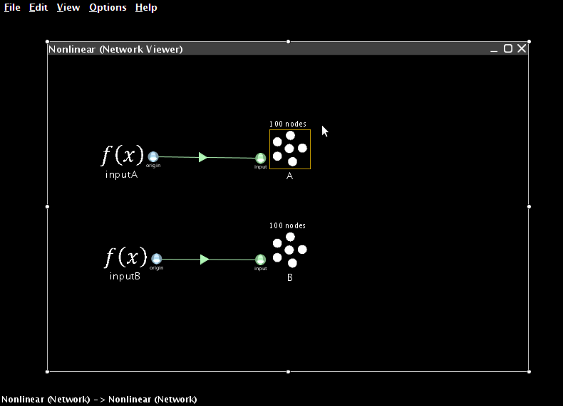
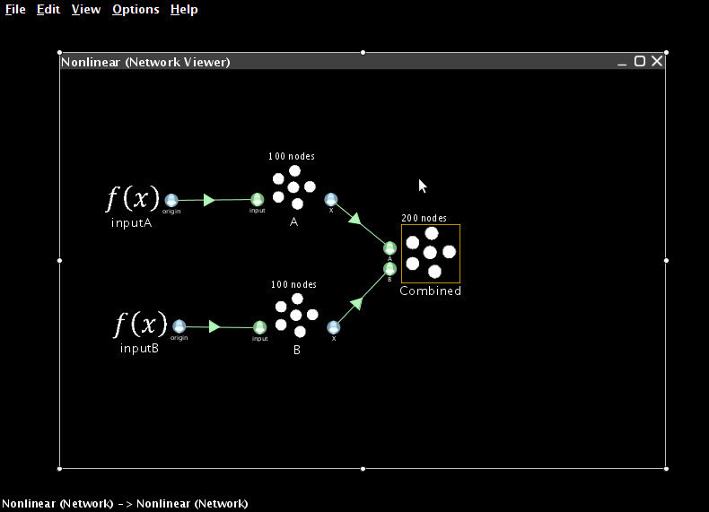
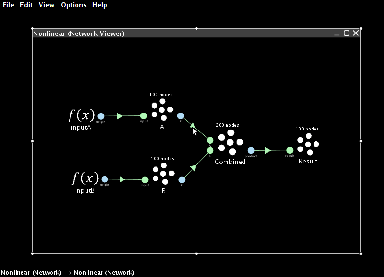
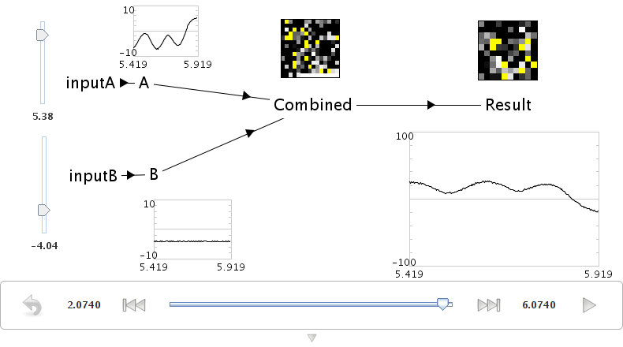
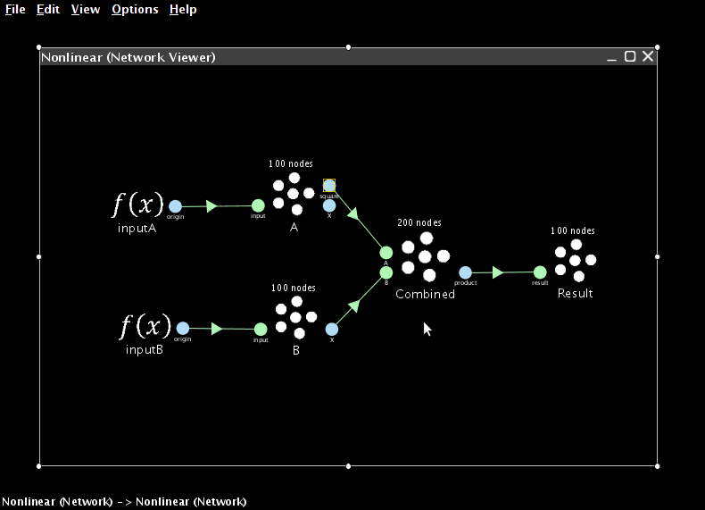

3. Nonlinear transformations
============================

Functions of one variable
-------------------------

We now turn to creating nonlinear transformations in Nengo.
The main idea here is that instead of using the X origin,
we will create a new origin
that estimates some arbitrary function of X.
This will allow us to estimate any desired function.

The accuracy of this estimate will, of course,
be dependent on the properties of the neurons,
and the function being estimated.

For one-dimensional ensembles,
we can calculate various 1-dimensional functions:

* :math:`f(x) = x^2`
* :math:`f(x) = \theta(x)` (thresholding)
* :math:`f(x) = \sqrt{x}`

To perform a nonlinear operation, we need to define a new origin
since the X origin always uses :math:`f(x) = x`.

* Create a new ensemble that is one-dimensional,
  with 100 neurons, and a radius of 1.

* Create a function input that is a Constant Function
  with the value set to 0.5.

* Create a termination on the ensemble
  and connect the function input to it.

Next, we will create a new origin
that will estimate the square of the value.
To do this:

* Drag the Origin icon from the sidebar onto the ensemble.

* Set the name to ``square``.

* Click on Set Functions.

* Select User-defined Function and click Set.

* For the Expression, enter ``x0 * x0``.

  We refer to the value as ``x0`` because
  when we extend this to multiple dimensions,
  we will refer to each dimension as ``x0``, ``x1``, ``x2``, and so on.

* Press OK, OK, and OK.

You can now generate a plot that shows
how good the ensemble is at calculating the nonlinearity.
Right-click on the ensemble
and select Plot -> Plot distortion:square.

.. image:: ../images/p3-9b.png

* Start Interactive Plots.

* Right-click on the input and select "control"
  so you can adjust it while the model runs.

* Right-click on the ensemble and select "square->value".

* For comparison, right-click on the ensemble and select "X->value".
  This is the standard value graph that
  shows the value being represented by this ensemble.

* Press Play to run the simulation.

  With the default input of 0.5, the squared value should be near 0.25.
  Use the control to adjust the input.
  The output should be the square of the input.

.. image:: ../images/p3-101.png

You can also run this example by opening ``demo/squaring.py``.

Functions of multiple variables
-------------------------------

Since X (the value being represented by an ensemble)
can also be multidimensional,
we can also calculate these sorts of functions

* :math:`f(x) = x_0 * x_1`
* :math:`f(x) = max(x_0, x_1)`

To begin, let's create two ensembles and two function inputs.
These will represent the two values we wish to multiply together.

* Create two new ensembles that are one-dimensional,
  use 100 neurons and have a radius of 10
  (so they can represent values between -10 and 10).

* Create two function inputs that emit the constant values 8 and 5.

* Create two terminations, one on each of the ensembles.
  Use the time constant 0.01 (AMPA).

* Create a two-dimensional ensemble with a radius of 15 called Combined.

  Since it needs to represent multiple values,
  increase the number of neurons it contains to 200.

* Add two terminations to Combined.

  * For both, the input dimensions are 1.

  * For the first one, use Set Weights
    to set the transformation to ``[1 0]``.

  * For the second one, use Set Weights
    to set the transformation to ``[0 1]``.

* Connect the two other ensembles to the Combined one.

* Create an ensemble to represent the result.
  Set the radius to 100, since it will need to represent values
  from -100 to 100 (i.e., ``max(10 * 10)``).

* Create a one-dimensional termination with a weight of 1
  on the result ensemble.

.. image:: ../images/p3-3.png

Now we need to create a new origin
that will estimate the product
between the two values stored in the combined ensemble.

* Drag the Origin icon onto the Combined ensemble.

* Set the name to ``product``.

* Set Output dimensions to 1.

  .. image:: ../images/p3-4.png

* Click on Set Functions.

* Select "User-defined Function" and press Set.

  .. image:: ../images/p3-5.png

* For the Expression, enter ``x0 * x1``

  .. image:: ../images/p3-6.png

* Press OK, OK, and OK to finish creating the origin.

* Connect the new origin to the termination on the result ensemble.

* Run the simulation with Interactive Plots,
  and view the appropriate graphs.

  The result should be approximately 40.

* Adjust the input controls to multiple different numbers together

You can also run this example by opening ``demo/multiplication.py``.

Combined approaches
-------------------

We can combine these two approaches
in order to compute more complex funxtions,
such as :math:`x^2 y`.

* Drag an Origin onto the ensemble
  representing the first of the two values.

  Give it the name "square", set its output dimensions to 1,
  and press Set Functions.

* As before, select the User-defined Function and press Set.

* Set the Expression to be ``x0 * x0``.

* Press OK, OK, and OK to finish creating the origin.

This new origin will calculate the square of the value
represented by this ensemble.

If you connect this new origin to the Combined ensemble
instead of the standard X origin,
the network will calculate :math:`x^2 y` instead of :math:`xy`.

.. note:: To remove the X origin projection,
          drag it away from the Combined population.
          Right-click the end of the line and select "Remove"
          to delete the projection altogether.

