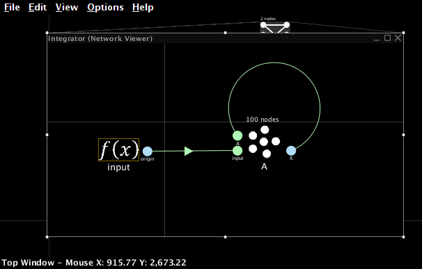
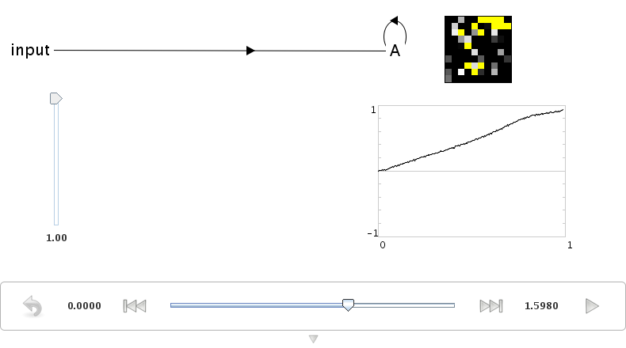
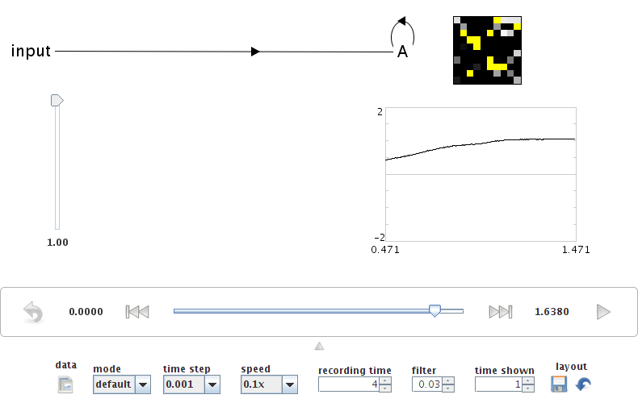
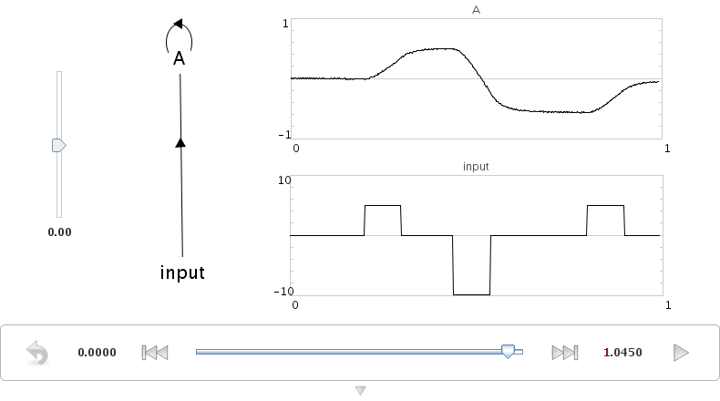
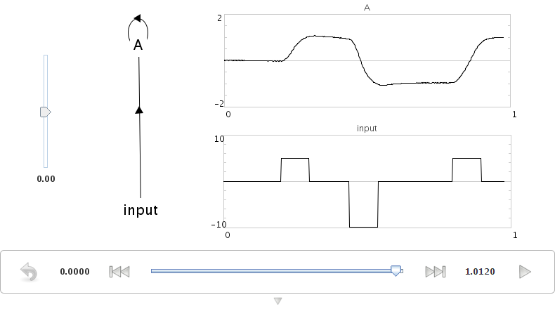
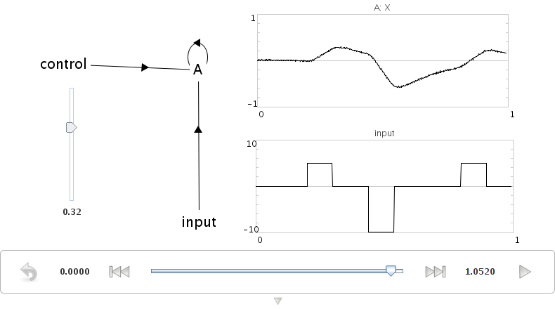

4. Feedback and dynamics
========================

Storing information over time
-----------------------------

**Constructing an integrator**

The basis of many of our cognitive models is the integrator.
Mathematically, the output of this network
should be the integral of the inputs to this network.

Practically speaking,
this means that if the input to the network is zero,
then its output will stay at whatever value it is currently at.
This makes it the basis of a neural memory system,
as a representation can be stored over time.
Integrators are also often used in sensorimotor systems,
such as eye control.

To construct an integrator, a neural ensemble
needs to connect to itself with a transformation weight of 1,
and have an input with a weight of :math:`\tau`,
which is the same as the synaptic time constant
of the neurotransmitter used.

* Create a one-dimensional ensemble called Integrator.
  Use 100 neurons and a radius of 1.

* Add two terminations with synaptic time constants of 0.1 seconds.

  Call the first one ``input`` and give it a weight of 0.1.

  Call the second one ``feedback`` and give it a weight of 1.

* Create a new Function input using a Constant Function with a value of 1.

* Connect the Function input to the ``input`` termination.

* Connect the X origin of the ensemble
  back to its own ``feedback`` termination.

* Go to Interactive Plots.

* Right-click on the ensemble and select "value".

* Press Play to run the simulation.

  The value stored in the ensemble should linearly increase,
  reaching a value of 1 after approximately 1 second.

You can increase the amount of time shown
on the graphs in Interactive Plots.
Do this by clicking on the small downwards-pointing arrow
at the bottom of the window.
This will reveal a variety of settings for Interactive Plots.

* Change the "time shown" to 1.

Representation range
--------------------

What happens if the previous simulation runs for longer than one second?

The value stored in the ensemble
does not increase after a certain point.
This is because all neural ensembles have a range of values
they can represent (the radius),
and cannot accurately represent outside of that range.

* Adjust the radius of the ensemble to 1.5
  using either the Configure interface or the script console
  (``that.radii = [1.5]``).

* Run the model again.

It should now accurately integrate up to a maximum of 1.5.

.. image:: ../images/p4-104.png

Complex input
-------------

We can also run the model with more complex input.
We will use the script console to define that input.

* Click the Function Input in the black model editing interface.

* Press Ctrl-1 (Command-1 OS X) to show the script console.

* Type::

    that.functions = [ca.nengo.math.impl.PiecewiseConstantFunction(
      [0.2, 0.3, 0.44, 0.54, 0.8, 0.9],
      [0, 5, 0, -10, 0, 5, 0])]

  and press enter.

You can see what this function looks like
by right-clicking on it in the editing interface
and selecting "plot function"

.. note:: Function index = 0, Start = 0, Increment = 0.001, End = 1

.. image:: ../images/p4-5.png

Return to Interactive Plots and run the simulation.

Adjusting synaptic time constants
---------------------------------

You can adjust the accuracy of an integrator
by using different neurotransmitters.

* Change the input termination to have a tau of 0.01 (10 ms: GABA)
  and a transform of 0.01 using the inspector.

* Cange the feedback termination to have a tau of 0.01,
  but leave its transform at 1.

By using a shorter time constant,
the network dynamics are more sensitive
to small-scale variation (i.e. noise).

This indicates how important
the use of a particular neurotransmitter is,
and why there are so many different types
with vastly differing time constants.

* AMPA: 2 -- 10 ms

* GABA:subscript:`A`: 10 -- 20 ms

* NMDA: 20 -- 150 ms

The actual details of these time constants
vary across the brain as well.
We are collecting empirical data on these
from various sources and making them available
`here <http://compneuro.uwaterloo.ca/research/constants-constraints/neurotransmitter-time-constants-pscs.html>`__.

You can also run this example using ``demo/integrator.py``.

Controlled integrator
---------------------

We can also build an integrator
where the feedback transformation
(1 in the previous model) can be controlled.
This allows us to build a tunable filter.

This requires the use of multiplication,
since we need to multiply two stored values together.
This was covered in the previous tutorial.

We can efficiently implement the controlled integrator
by using a two-dimensional ensemble.
One dimension will hold the value being represented,
and the other dimension will hold the transformation weight.

* Create a two-dimensional ensemble
  with 225 neurons and a radius of 1.5.

* Create an ``input`` termination with 1 dimension,
  time constant of 0.1,
  and a transformation matrix of ``[0.1 0]``.
  This will act the same as the input in the previous model,
  but only affecting the first dimension.

* Create a ``control`` termination with 1 dimension,
  time constant of 0.1,
  and a transformation matrix of ``[0 1]``.
  This will store the input control signal
  in the second dimension of the ensemble.

* Create a ``feedback`` termination with 1 dimension,
  time constant of 0.1,
  and a transformation matrix of ``[1 0]``.
  This will be used in the same manner
  as the feedback termination in the previous model.

* Create a new origin that multiplies the values in the vector together.

  This origin is exactly the same as the multiplier
  in the previous tutorial.
  It is 1 dimensional, with a User-defined Function of ``x0 * x1``.

* Create two Function Inputs called ``input`` and ``control``.
  Set both to be Constant functions with a value of 1.

* Use the script console to set the ``input`` Function Input
  by clicking on it and entering the same input function as used above::

    that.functions = [ca.nengo.math.impl.PiecewiseConstantFunction(
      [0.2, 0.3, 0.44, 0.54, 0.8, 0.9],
      [0, 5, 0, -10, 0, 5, 0])]

* Connect the input function to the input termination.

* Connect the control function to the control termination.

* Connect the product origin to the feedback termination.

.. image:: ../images/p4-9.png

* Open the Interactive Plots.

* Show a graph for the value of the ensemble (right-click -> X -> value).

If you run the simulation,
this graph will show the values of both variables
stored in this ensemble (the integrated value and the control signal).
For clarity, turn off the display of the control signal.

* Right-click on the value graph and remove the checkmark beside "v[1]".

The performance of this model
should be similar to that of the non-controlled integrator.

.. image:: ../images/p4-107.png

* Adjust the control input to be 0.3 instead of 1.

This will make the integrator into a leaky integrator.
This value adjusts how quickly the integrator forgets over time.

You can also run this example using ``demo/controlledintegrator.py``.
