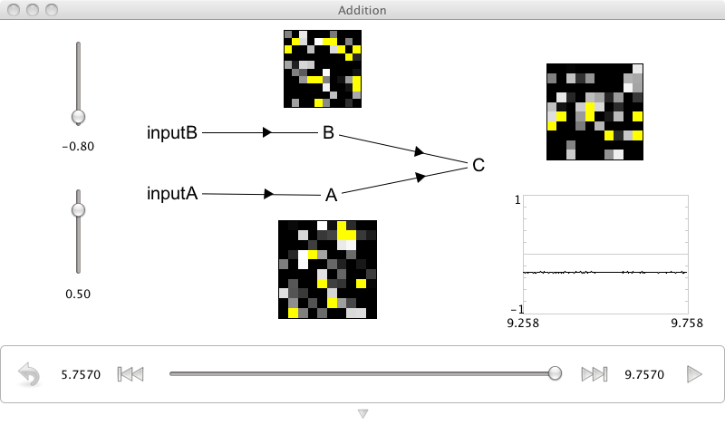

Addition
============================
*Purpose*: This demo shows how to construct a network that adds two inputs.

*Comments*: Essentially, this is two communication channels into the same population.  Addition is thus somewhat 'free', since the incoming currents from different synaptic connections interact linearly (though two inputs don't have to combine in this way: see the combining demo).

*Usage*: Grab the slider controls and move them up and down to see the effects of increasing or decreasing input. The C population represents the sum of A and B representations.  Note that the 'addition' is a description of neural firing in the decoded space.  Neurons don't just add all the incoming spikes (the NEF has determined appropriate connection weights to make the result in C interpretable (i.e., decodable) as the sum of A and B).

*Output*: See the screen capture below

*Code*::
    
    import nef
    
    net=nef.Network('Addition')
    inputA=net.make_input('inputA',[0])
    inputB=net.make_input('inputB',[0])
    A=net.make('A',100,1,quick=True)
    B=net.make('B',100,1,quick=True,storage_code='B')
    C=net.make('C',100,1,quick=True,storage_code='C')
    net.connect(inputA,A)
    net.connect(inputB,B)
    net.connect(A,C)
    net.connect(B,C)
    net.add_to(world)

