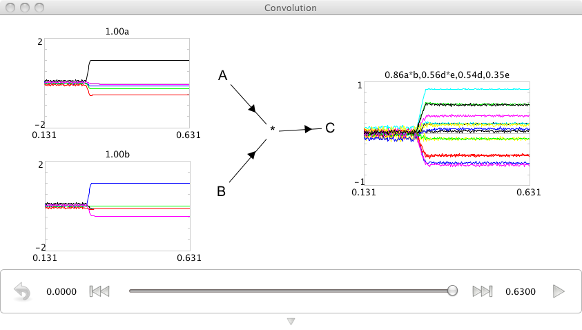

Circular Convolution
============================

*Purpose*: This demo shows how to exploit the hrr library to do binding of vector representations.

*Comments*: The binding operator we use is circular convolution.  This example is in a 10-dimensional space.

This (or any similar) binding operator (see work on vector symbolic architectures (VSAs)) is important for cognitive models.  This is because such operators lets you construct structured representations in a high-dimensional vector space.

*Usage*: The best way to change the input is to right-click the 'semantic pointer' graphs and set the value to one of the elements in the vocabulary (defined as a, b, c, d, or e in the code) by typing it in.  Each element in the vocabulary is a randomly chosen vector. Set a different value for the two input graphs.

The `C' population represents the output of a neurally-computed circular convolution (i.e., binding) of the `A' and `B' input vectors. The label above each semantic pointer graph displays the name of the vocabulary vectors that are most similar to the vector represented by that neural ensemble. The number preceding the vector name is the value of the normalized dot product between the two vectors (i.e., the similarity of the vectors). 

In this simulation, the `most similar' vocabulary vector for the `C' ensemble is `a*b'. The `a*b' vector is the analytically-calculated circular convolution of the `a' and `b' vocabulary vectors. This result is expected, of course. Also of note is that the similarity of the `a' and `b' vectors alone is significantly lower. Both of the original input vectors should have a low degree of similarity to the result of the binding operation. Toggling the `show pairs' option of the graph makes the difference even clearer. The `show pairs' option controls whether bound pairs of vocabulary vectors are included in the graph.

*Output*: See the screen capture below

*Code*::
    
    import nef
    import nef.convolution
    import hrr
    
    D=10
    
    vocab=hrr.Vocabulary(D, include_pairs=True)
    vocab.parse('a+b+c+d+e')
    
    net=nef.Network('Convolution')
    A=net.make('A',300,D,quick=True)
    B=net.make('B',300,D,quick=True)
    C=net.make('C',300,D,quick=True)
    conv=nef.convolution.make_convolution(net,'*',A,B,C,100,quick=True)
    
    net.add_to(world)

