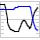

Nengo Demos
===========================================

This section describes the collection of demos that comes with Nengo. To use any of these demo scripts in Nengo, do the following:

* *Open*
    Open any ``<demo>.py`` file by clicking on the |open| icon (or going to ``File->Open from file`` in the menu) and selecting the file from ``demos`` directory in your Nengo installation. 
* *Run* 
    Run the demo by selecting the network created in the previous step and then clicking the |interactive| icon in the upper right corner of the Nengo main window.  Alternatively, 
    right-click on the network and select 'Interactive Plots'.  Click the |play| arrow to start the simulation.
    
    .. note::    
       You don't need to select the network if there is only one available to run.
       
* *Delete* 
    Remove the demo network after using it by right clicking and selecting 'Remove model'. 
    
    .. note::
        You don't need to remove a model if you reload the same script again, it will automatically be replaced.
 
.. |open| image:: ../../python/images/open.png
    :scale: 75 %

 
More sophisticated examples can be found in the Model Archive at http://models.nengo.ca.
 
Introductory Demos
------------------------
.. toctree::
   :maxdepth: 1
   
   singleneuron
   twoneurons
   manyneurons
   2drepresentation
   
Simple Transformations
------------------------
.. toctree::
   :maxdepth: 1
   
   communication   
   squaring
   addition
   combining
   multiplication
   convolve

Dynamics
------------------------

.. toctree::
   :maxdepth: 1
   
   integrator
   controlledintegrator
   controlledintegrator2
   oscillator

Basal Ganglia Based Simulations
-------------------------------

.. toctree::
   :maxdepth: 1

   basalganglia
   spa_sequence
   spa_sequencerouted
   question
   question-memory
   question-control

Learning
------------------------
.. toctree::
   :maxdepth: 1
   
   learn_communicate
   learn_product
   learn_square

Miscellaneous
------------------------
.. toctree::
   :maxdepth: 1
   
   vehicle
   armcontrol

