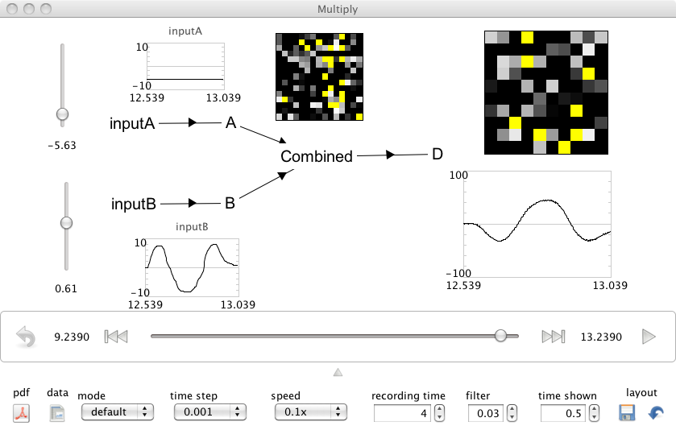

Performing Multiplication
============================
*Purpose*: This demo shows how to construct a network that multiplies two inputs.

*Comments*: This can be thought of as a combination of the combining demo and the squaring demo.  Essentially, we project both inputs independently into a 2D space, and then decode a nonlinear transformation of that space (the product of the first and second vector elements).

Multiplication is extremely powerful.  Following the simple usage instructions below suggests how you can exploit it to do gating of information into a population, as well as radically change the response of a neuron to its input (i.e. completely invert its 'tuning' to one input dimension by manipulating the other).

*Usage*: Grab the slider controls and move them up and down to see the effects of increasing or decreasing input. The output is the product of the inputs.  To see this quickly, leave one at zero and move the other. Or, set one input at -1 and watch the output slope go down as you move the other input up from -1 to 1.

*Output*: See the screen capture below

*Code*::
    
    import nef
    
    net=nef.Network('Multiply')
    inputA=net.make_input('inputA',[8])
    inputB=net.make_input('inputB',[5])
    A=net.make('A',100,1,radius=10,quick=True)
    B=net.make('B',100,1,radius=10,quick=True,storage_code='B')
    C=net.make('Combined',225,2,radius=15,quick=True)
    D=net.make('D',100,1,radius=100,quick=True,storage_code='D')
    net.connect(inputA,A)
    net.connect(inputB,B)
    net.connect(A,C,transform=[1,0])
    net.connect(B,C,transform=[0,1])
    def product(x):
        return x[0]*x[1]
    net.connect(C,D,func=product)
    net.add_to(world)

