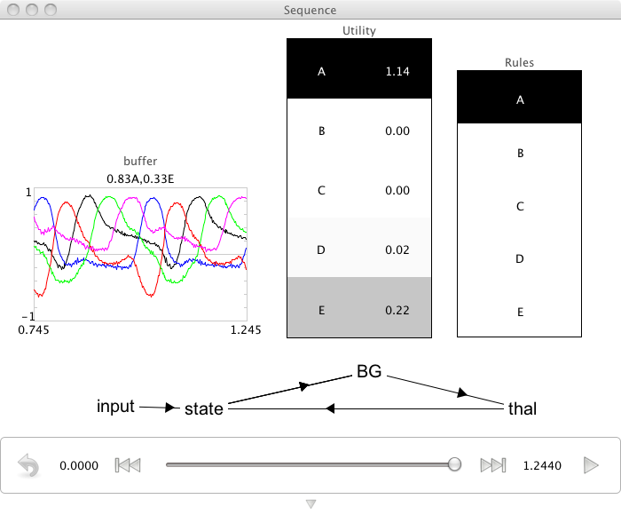

Cycling Through a Sequence
================================================
*Purpose*: This demo uses the basal ganglia model to cycle through a 5 element sequence.

*Comments*: This basal ganglia is now hooked up to a memory.  This allows it to update that memory based on its current input/action mappings.  The mappings are defined in the code such that A->B, B->C, etc. until E->A completing a loop.  This uses the convenient 'spa' module.

*Usage*: When you run the network, it will go through the sequence forever.  It's interesting to note the distance between the 'peaks' of the selected items.  It's about 40ms for this simple action.  We like to make a big deal of this.

*Output*: See the screen capture below. 

*Code*::

    from spa import *
    
    D=16 
    class Rules:
        def A(state='A'):
            set(state='B')
        def B(state='B'):
            set(state='C')
        def C(state='C'):
            set(state='D')
        def D(state='D'):
            set(state='E')
        def E(state='E'):
            set(state='A')
    
    class Sequence(SPA):
        dimensions=16
        
        state=Buffer()
        BG=BasalGanglia(Rules())
        thal=Thalamus(BG)
        
        input=Input(0.1,state='D')
    
    seq=Sequence()
