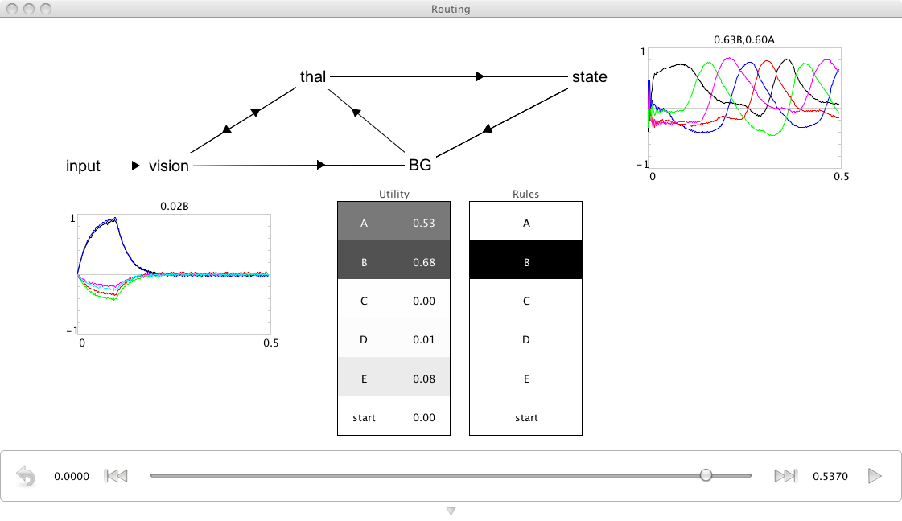

Routed Sequencing
================================================
*Purpose*: This demo uses the basal ganglia model to cycle through a 5 element sequence, where an arbitrary start can be presented to the model.

*Comments*: This basal ganglia is now hooked up to a memory and includes routing.  The addition of routing allows the system to choose between two different actions: whether to go through the sequence, or be driven by the visual input.  If the visual input has its value set to LETTER+D (for instance), it will begin cycling through at D->E, etc.  

The 'utility' graph shows the utility of each rule going into the basal ganglia. The 'rule' graph shows which one has been selected and is driving thalamus.

*Usage*: When you run the network, it will go through the sequence forever, starting at D.  You can right-click the SPA graph and set the value to anything else (e.g. 'LETTER+B') and it will start at the new letter and then begin to sequence through.  The point is partly that it can ignore the input after its first been shown and doesn't perseverate on the letter as it would without gating.

*Output*: See the screen capture below. 

*Code*:
    .. literalinclude:: ../../dist-files/demo/spa_sequencerouted.py
