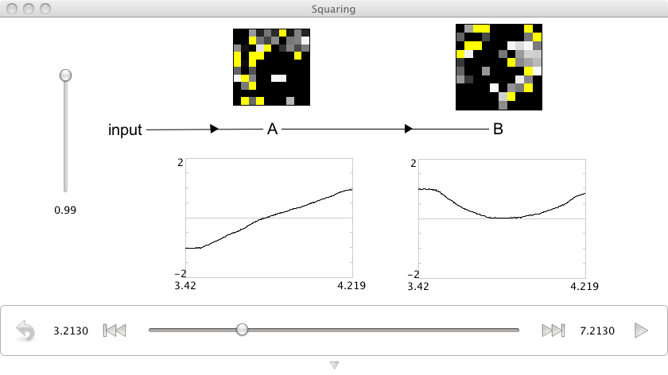

Squaring the Input
================================================
*Purpose*: This demo shows how to construct a network that squares the value encoded in a first population in the output of a second population.

*Comments*: This is a simple nonlinear function being decoded in the connection weights between the cells.  Previous demos are linear decodings.

*Usage*: Grab the slider control and move it up and down to see the effects of increasing or decreasing input. Notice that the output value does not go negative even for negative inputs.  Dragging the input slowly from -1 to 1 will approximately trace a quadratic curve in the output.

*Output*: See the screen capture below

*Code*:
    .. literalinclude:: ../../dist-files/demo/squaring.py

