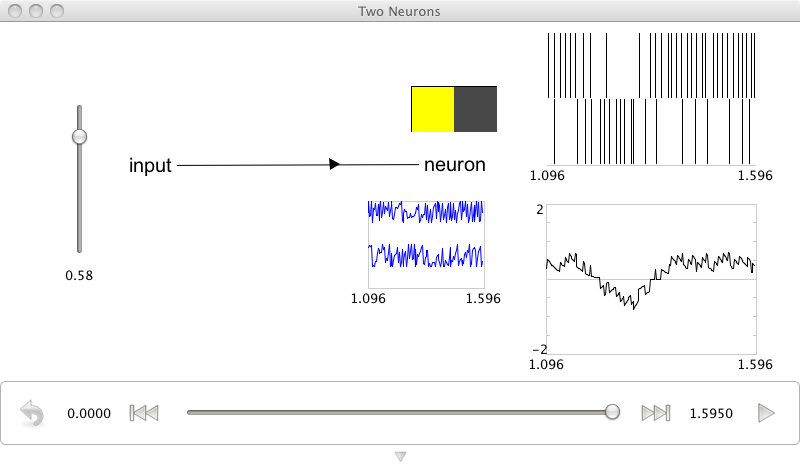

Two Neurons
================================================

*Purpose*: This demo shows how to construct and manipulate a complementary pair of neurons.

*Comments*: These are leaky integrate-and-fire (LIF) neurons. The neuron tuning properties have been selected so there is one 'on' and one 'off' neuron. 

*Usage*: Grab the slider control and move it up and down to see the effects of increasing or decreasing input. One neuron will increase for positive input, and the other will decrease.  This can be thought of as the simplest population to give a reasonable representatino of a scalar value. 

*Output*: See the screen capture below

*Code*::

    import nef
    
    net=nef.Network('Two Neurons')
    input=net.make_input('input',[-0.45])
    neuron=net.make('neuron',2,1,max_rate=(100,100),intercept=(-0.5,-0.5),encoders=[[1],[-1]],noise=3)
    net.connect(input,neuron)
    net.add_to(world)

