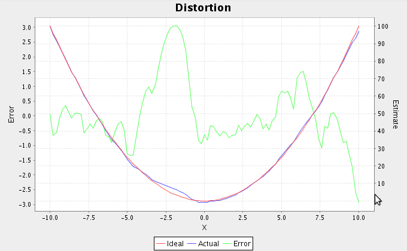
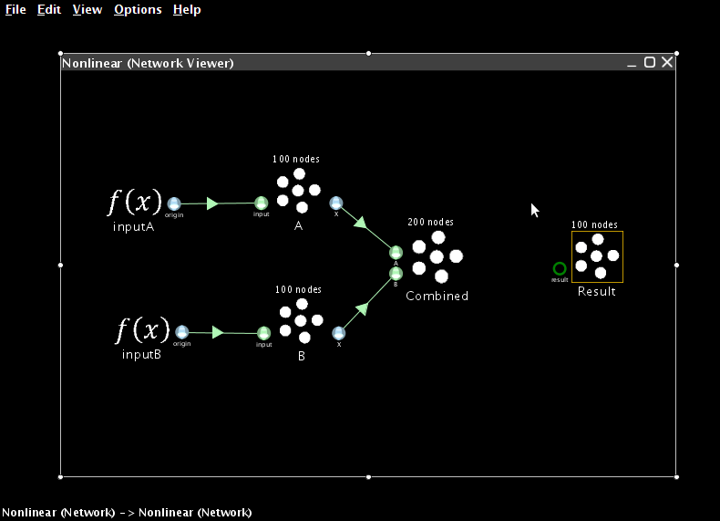

Non-Linear Transformations
============================

Functions of one variable
-------------------------

* We now turn to creating nonlinear transformations in Nengo.  The main idea here is that instead of using the X origin, we will create a new origin that estimates some arbitrary function of X.  This will allow us to estimate any desired function.

   * The accuracy of this estimate will, of course, be dependent on the properties of the neurons.
   
* For one-dimensional ensembles, we can calculate various 1-dimensional functions:

   * :math:`f(x)=x^2`
   * :math:`f(x)=\theta(x)` (thresholding)
   * :math:`f(x)=\sqrt{x}`

* To perform a non-linear operation, we need to define a new origin

   * The X origin just uses :math:`f(x)=x`.
   * Create a new ensemble and a function input.  The ensemble should be one-dimensional with 100 neurons and a radius of 1.  Use a Constant Function input set two 0.5.
   * Create a termination on the ensemble and connect the function input to it
   * Now create a new origin that will estimate the square of the value.
   
     * Right-click on the combined ensemble and select Add decoded origin
     * Set the name to ``square``
     * Click on Set Functions
     * Select User-defined Function and press Set
     * For the Expression, enter ``x0*x0``.   We refer to the value as x0 because when we extend this to multiple dimensions, we will refer to them as x0, x1, x2, and so on.
     * Press OK, OK, and OK.
     
   * You can now generate a plot that shows how good the ensemble is at calculating the non-linearity. Right-click on the ensemble and select Plot->Plot distortion:square.

   - Start Interactive Plots.  
   - Create a control for the input, so you can adjust it while the model runs (right-click on the input and select "control")
   - Create a graph of the "square" value from the ensemble.  Do this by right-clicking on the ensemble in the Interactive Plots window and selecting "square->value".
   - For comparison, also create a graph for the standard X origin byt right-clicking on the ensemble and selecting "X->value".  This is the standard value graph that just shows the value being represented by this ensemble.
   - Press Play to run the simulation.  With the default input of 0.5, the squared value should be near 0.25.  Use the control to adjust the input.  The output should be the square of the input.

.. image:: images/p3-101.png

 - You can also run this example using scripting
<code>
run demo/squaring.py
</code>

## Functions of multiple variables

 - Since X (the value being represented by an ensemble) can also be multidimensional, we can also calculate these sorts of functions
   - f(x)=x0*x1
   - f(x)=max(x0,x1)
 - To begin, we create two ensembles and two function inputs.  These will represent the two values we wish to multiply together.
   - The ensembles should be one-dimensional, use 100 neurons and have a radius of 10 (so they can represent values between -10 and 10)
   - The two function inputs should be constants set to 8 and 5
   - The terminations you create to connect them should have time constants of 0.01 (AMPA)

.. image:: images/p3-1.png

 - Now create a two-dimensional neural ensemble with a radius of 15 called Combined
   - Since it needs to represent multiple values, we increase the number of neurons it contains to 200
 - Add two terminations to Combined
   - For each one, the input dimensions are 1
   - For the first one, use Set Weights to make the transformation be [1 0]
   - For the second one, use Set Weights to make the transformation be [0 1]
 - Connect the two other ensembles to the Combined one

.. image:: images/p3-2.png

 - Next, create an ensemble to store the result.  It should have a radius of 100, since it will need to represent values from -100 to 100.  Give it a single one-dimensional termination with a weight of 1.

 - Now we need to create a new origin that will estimate the product between the two values stored in the combined ensemble.
   - Right-click on the combined ensemble and select Add decoded origin.
   - Set the name to “product”
   - Set Output dimensions to 1

.. image:: images/p3-4.png

   - Click on Set Functions
   - Select User-defined Function and press Set.

.. image:: images/p3-5.png

   - For the Expression, enter x0*x1

.. image:: images/p3-6.png

   - Press OK, OK, and OK to finish creating the origin
 - Connect the new origin to the termination on the result ensemble

.. image:: images/p3-7.png

 - Add a probe to the result ensemble and run the simulation
 - The result should be approximately 40.
 - Adjust the input controls to multiple different numbers together.

.. image:: images/p3-102.png

 - You can also run this example using scripting
<code>
run demo/multiplication.py
</code>

## Combined approaches

 - We can combine these two approaches in order to compute more complex funxtions, such as x2y.
   - Right-click on the ensemble representing the first of the two values and select Add decoded origin.
   - Give it the name "square", set its output dimensions to 1, and press Set Functions.
   - As before, select the User-defined Function and press Set.
   - Set the Expression to be "x0*x0".  
   - Press OK, OK, and OK to finish creating the origin.
   - This new origin will calculate the square of the value represented by this ensemble.
   - If you connect this new origin to the Combined ensemble instead of the standard X origin, the network will calculate x2y instead of xy.

.. image:: images/p3-9a.png

