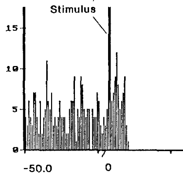
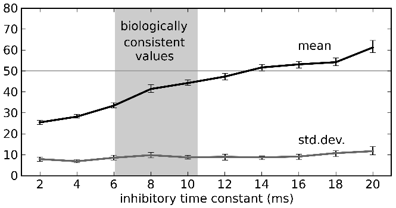

Cognitive Models
==================

Larger Systems
---------------

* So far, we've seen how to implement the various basic components

   * representations
   * linear transformation
   * non-linear transformation
   * feedback
   
* It is possible to use these components to build full cognitive models using spiking neurons (see http://nengo.ca/build-a-brain):

   * Constrained by the actual properties of real neurons in real brains (numbers of neurons, connectivity, neurotransmitters, etc.)
   * That should be able to produce behavioural predictions in terms of timing, accuracy, lesion effects, drug treatments, etc.
   
* Some simple examples

   * Motor control
   
     * take an existing engineering control model for what angles to move joints to to place the hand at a particular position::

        open "demo/armcontrol.py"

   .. image:: images/p5-101.png

   * Braitenberg vehicle
   
     * connect range sensors to opposite motors on a wheeled robot::

        open "demo/vehicle.py"

   .. image:: images/p5-102.png

Binding Semantic Pointers (SPs)
---------------------------------

* We want to manipulate sophisticated representational states (this is the purpose of describing the Semantic Pointer Architecture (SPA; http://nengo.ca/build-a-brain)) 
* The main operation to manipulate representations in the SPA is circular convolution (for binding)
* Let's explore a binding circuit for semantic pointers

* Input: Two semantic pointers (high-dimensional vectors)
* Output: One semantic pointer (binding the original two)

* Implementation: element-wise multiplication of DFT (i.e., circular convolution) (Note: there is a drag and drop template for this operation)::

    open "demo/convolve.py"

.. image:: images/p5-201.png

* To deal with high-dimensional vectors, we don't want to have to set each individual value for each vector

   * would need 100 controls to configure a single 100-dimensional vector
   
* Nengo Interactive Plots has a specialized "semantic pointer" graph for these high-dimensional cases

   * Instead of showing the value of each element in the vector (as with a normal graph), it shows the similarity between the currently represented vector and all the known vectors
   * "How much like CAT is this?  How much like DOG?  How much like RED?  How much like TRIANGLE?"
   * You can configure which comparisons are shown using the right-click menu
   * You can also use it to _set_ the contents of a neural group by right-clicking and choosing "set value".  This will force the neurons to represent the given semantic pointer.  You can go back to normal behaviour by selecting "release value".

* Use the right-click menu to set the input values to "a" and "b".  The output should be similar to "a*b".

   * This shows that the network is capable of computing the circular convolution operation, which binds two semantic pointers to create a third one.
   
* Use the right-click menu to set the input values to "a" and "~a*b".  The output should be similar to "b" (Note: '~' is an approximate inverse operator)

   * This shows that convolution can be used to transform representations via binding and unbinding, since "a*(~a*b)" is approximately "b".

Control and Action Selection: Basal Ganglia
---------------------------------------------

* Note: Much of what follows is summarized in Chp 5 of "How to build a brain," and can be constructed using the drag and drop templates in Nengo (specifically, Basal Ganglia, BG Rule, Thalamus, Binding, Gate, and Integrator)  

* Also see the relevant "demos" section of the documentation (http://nengo.ca/docs/html/demos/demos.html#basal-ganglia-based-simulations)

* Pretty much every cognitive model has an action selection component with these features:

   * Out of many possible things you could do right now, pick one
   * Usually mapped on to the basal ganglia
   * Some sort of winner-take-all calculation based on how suitable the various possible actions are to the current situation
   
* Input: A vector representing how good each action is (for example, [0.2, 0.3, 0.9, 0.1, 0.7])
* Output: Which action to take ([0, 0, 1, 0, 0])

   * Actually, the output from the basal ganglia is inhibitory, so the output is more like [1, 1, 0, 1, 1]

* Implementation

   * Could try doing it as a direct function
   
     * Highly non-linear function
     * Low accuracy
     
   * Could do it by setting up inhibitory interconnections
   
     * Like the integrator, but any value above zero would also act to decrease the others
     * Often used in non-spiking neural networks (e.g. PDP++) to do k-winner-take-all
     * But, you have to wait for the network to settle, so it can be rather slow
     
   * Gurney, Prescott, & Redgrave (2001) (In Nengo there is a drag and drop template for this BG model)
   
     * Model of action selection constrained by the connectivity of the basal ganglia

   .. image:: images/p5-103.png

   * Each component computes the following function

   .. image:: images/p5-104.png

   * Their model uses unrealistic rate neurons with that function for an output
   * We can use populations of spiking neurons and compute that function
   * We can also use correct timing values for the neurotransmitters involved::

        open demo/basalganglia.py

* Adjust the input controls to change the five utility values being selected between
* Graph shows the output from the basal ganglia (each line shows a different action)
* The selected action is the one set to zero 

.. image:: images/p5-105.png

* Comparison to neural data

   * Ryan & Clark, 1991
   * Stimulate regions in medial orbitofrontal cortex, measure from GPi, see how long it takes for a response to occur

* To replicate
 
   * Set the inputs to [0, 0, 0.6, 0, 0]
   * Run simulation for a bit, then pause it
   * Set the inputs to [0, 0, 0.6, 1, 0]
   * Continue simulation
   * Measure how long it takes for the neurons for the fourth action to stop firing
   
   .. image:: images/p5-107.png

   * In rats: 14-17ms.  In model: 14ms (or more if the injected current isn't extremely large)

   .. image:: images/p5-108.png
   
* For details, see Stewart et al., 2010 (http://ctnsrv.uwaterloo.ca/cnrglab/node/53)

Sequences of Actions
--------------------

* To do something useful with the action selection system we need two things

   * A way to determine the utility of each action given the current context
   * A way to take the output from the action selection and have it affect behaviour
   
* We do this using the representations of the semantic pointer architecture

   * Any cognitive state is represented as a high-dimensional vector (a semantic pointer)
   * Working memory stores semantic pointers (using an integrator)
   * Calculate the utility of an action by computing the dot product between the current state and the state for the action (i.e. the IF portion of an IF-THEN production rule)
   
     * This is a linear operation, so we can directly compute it using the connection weights between the cortex and the basal ganglia
     
   * The THEN portion of a rule says what semantic pointers to send to what areas of the brain.  This is again a linear operation that can be computed on the output of the thalamus using the output from the basal ganglia
   
* Simple example: 

   * Five possible states: A, B, C, D, and E
   * Rules for IF A THEN B, IF B THEN C, IF C THEN D, IF D THEN E, IF E THEN A
   * Five *production rules* (semantic pointer mappings) cycling through the five states::

        open demo/sequence.py

   .. image:: images/p5-109.png

* Can set the contents of working memory in Interactive Plots by opening an SP graph, right-clicking on it, and choosing "set value" (use "release value" to allow the model to change the contents)
* Cycle time is around 40ms, slightly faster than the standard 50ms value used in ACT-R, Soar, EPIC, etc.

   * This depends on the time constant for the neurotransmitter GABA

Routing of Information
------------------------

* What about more complex actions?

   * Same model as above, be we want visual input to be able to control where we start the sequence
   * Simple approach: add a visual buffer and connect it to the working memory::

        open demo/sequencenogate.py

   .. image:: images/p5-113.png

* Problem: If this connection always exists, then the visual input will always override what's in working memory. This connection needs to be controllable

* Solution

   * Actions need to be able to control the flow of information between cortical areas.
   * Instead of sending a particular SP to working memory, we need "IF X THEN transfer the pattern in cortex area Y to cortex area Z"?
   * In this case, we add a rule that says "IF it contains a letter, transfer the data from the visual area to working memory"   
   * We make the utility of the rule lower than the utility of the sequence rules, so that it will only transfer that information (open that gate) when no other action applies::

        open demo/sequencerouted.py

.. image:: images/p5-112.png

* The pattern in the visual buffer is successfully transferred to working memory, then the sequence is continued from that letter.

.. image:: images/p5-111.png

* Takes longer (60-70ms) for these more complex productions to occur

Question Answering
-------------------

* The control signal in the previous network can also be another semantic pointer that binds/unbinds the contents of the visual buffer (instead of just a gating signal)

    * This more flexible control does not add processing time
    * Allows processing the representations while routing them
    
* This allows us to perform arbitrary symbol manipulation such as "take the contents of buffer X, unbind it with buffer Y, and place the results in buffer Z"
* Example: Question answering

   * System is presented with a statement such as "red triangle and blue circle"
   
     * a semantic pointer representing this statement is placed in the visual cortical area
     * ``statement+red*triangle+blue*circle``
     
   * Statement is removed after a period of time
   * Now a question is presented, such as "What was Red?"
   
     * ``question+red`` is presented to the same visual cortical area as before
     
   * Goal is to place the correct answer in a motor cortex area (in this case, "triangle")
   
* This is achieved by creating two action rules:

   * If a statement is in the visual area, move it to working memory (as in the previous example)
   * If a question is in the visual area, unbind it with working memory and place the result in the motor area
   
* This example requires a much larger simulation than any of the others in this tutorial (more than 50,000 neurons).  If you run this script, Nengo may take a long time 
  (hours!) to solve for the decoders and neural connection weights needed.  We have pre-computed the larger of these networks for you, and they can be 
  downloaded at http://ctn.uwaterloo.ca/~cnrglab/f/question.zip::
  
    open demo/question.py

.. image:: images/p5-202.png

